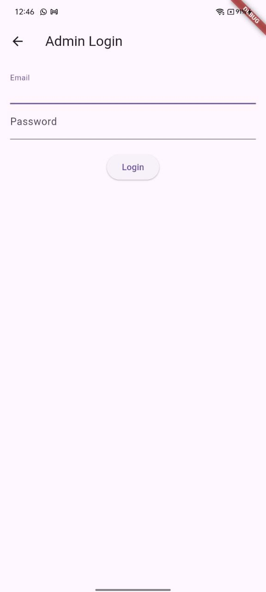
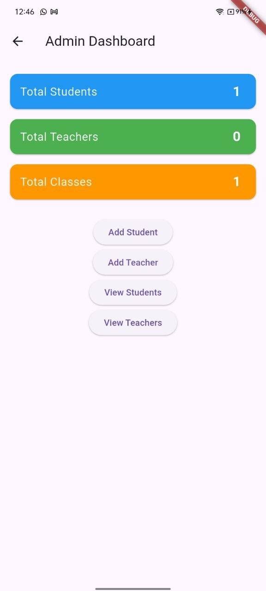
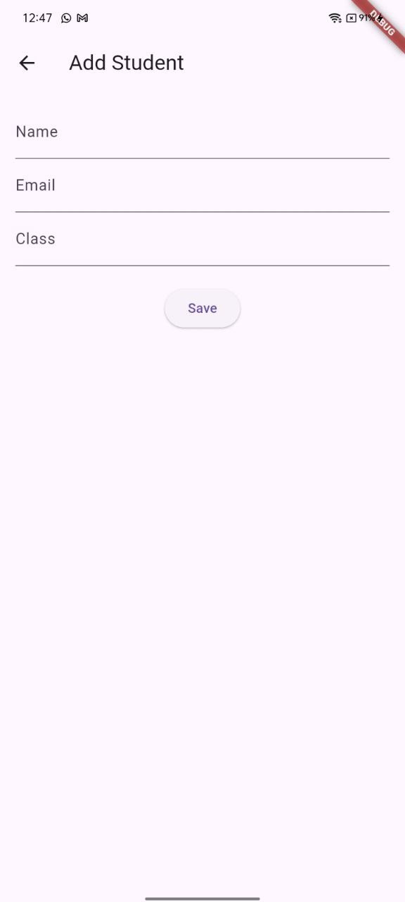
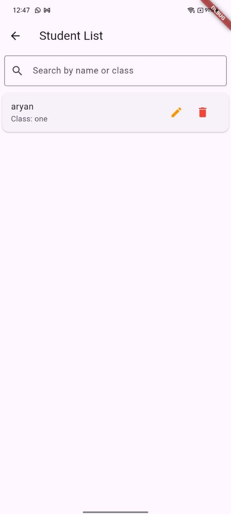
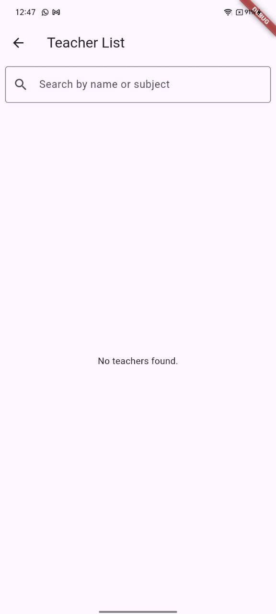
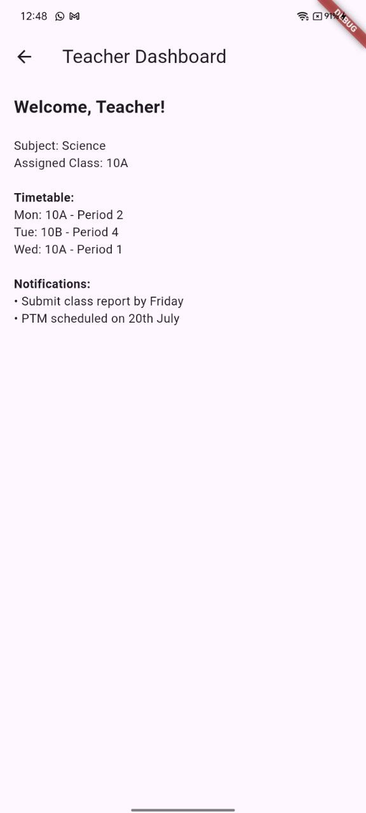
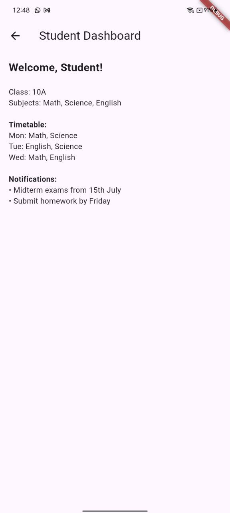

# 🏫 Mini School Management System

A beginner-friendly Flutter application that simulates a basic school management system. The app features an **Admin Panel** and a **User Panel (for Teachers and Students)** using **local dummy data** (no backend) stored via **Shared Preferences**.

---

## 📐 Architecture Overview

This project follows a **clean, modular architecture** for maintainability and clarity:

### 🔧 Key Concepts:
- **Shared Preferences**: Used to simulate storage of students and teachers.
- **Stateful Widgets**: Handle dynamic UI like lists, search, edit, delete.
- **Routing**: Uses `Navigator` for screen transitions.
- **Role-Based Login**: Switch between admin, teacher, and student panels.
- **UI**: Built using Flutter’s Material Design widgets.

---

## ▶️ How to Run the App

> Ensure Flutter SDK is installed and your device/emulator is running.

### 🔧 Setup Instructions:

1. **Clone the repository:**
   ```bash
   git clone https://github.com/Aryan-Singh02/mini_school_management_flutter.git
   cd mini_school_app

2. **Install dependencies:**
    ```bash
    flutter pub get

3. **Run the App**
    ```bash
    flutter run


## 🔑 Login Credentials

### 👨‍🏫 Admin Panel
    Username: admin
    Password: admin123

## 🖼 Screenshots

### 🧑‍💼 Admin Login
<p align="center">
    
</p>

### 📊 Admin Dashboard
    

### ➕ Add Student / Teacher
    
    

### 📋 Student List and Teacher List with Search
    
    

### 🧑‍🏫 Teacher Dashboard
    

### 🎓 Student Dashboard
    

## 📌 Features

- Admin Login with hardcoded credentials.
- Add, View, Edit, Delete Students and Teachers.
- Display Stats: Total Students, Teachers, Classes.
- Role-based User Panels (Teacher/Student).
- Timetable and Notifications (Static Data).
- Search and Filter Functionality in Lists.

## 📁 Tech Stack

- Flutter (UI SDK)
- Dart (Language)
- Shared Preferences (Local key-value storage)